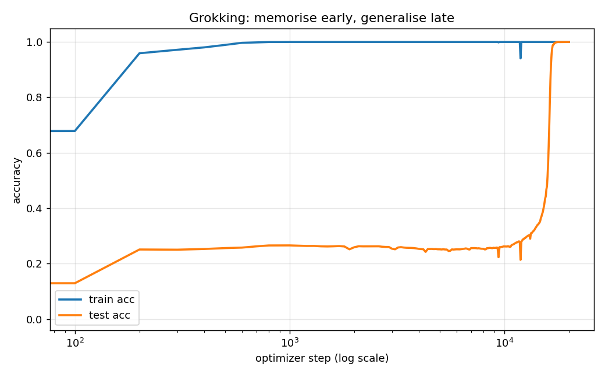
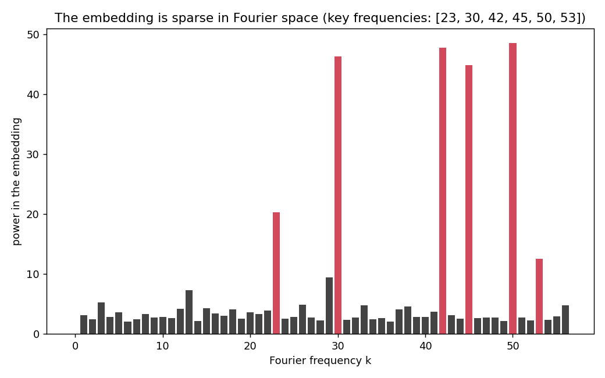

# Grokking modular addition

A tiny transformer is trained to compute `(a + b) mod 113`, but it is shown only
30% of the possible pairs. It memorises those almost immediately and gets every
held-out pair wrong for a long time. Then, thousands of steps later, with nothing
changing but continued training, its accuracy on the pairs it has never seen
snaps from noise to almost 100%. That late, sudden jump is called *grokking*, and
the second half of this repo opens the trained model up and shows the actual
algorithm it found to do it.

## How to use the repo

Install the requirements (torch, numpy, matplotlib, pyyaml):

```bash
pip install -r requirements.txt
```

Optional but recommended, run the sanity checks first. They take a second and
tell you the data and the model are wired correctly before you spend 25 minutes
training:

```bash
python notebooks/00_sanity_check.py     # data shapes, labels, starting loss
python notebooks/01_fourier_check.py     # checks the analysis method itself
```

Train the model (about 25 minutes on a CPU, seconds on a GPU):

```bash
python src/grokking/train.py             # or: python src/grokking/train.py 300  for a quick run
```

Then read the algorithm back out of the weights:

```bash
python src/grokking/analyze.py
```

Training writes `runs/model.pt` and `runs/metrics.json`. Analysis writes the two
figures below into `assets/` and a small `runs/summary.json`. A trained model is
already committed, so you can run `analyze.py` on its own without training first.

## Overview

The whole thing is one loop. Every pair `(a, b)` becomes a length-3 sequence
`[a, b, =]`, where `=` is a special token that marks where the answer should
come out. The model reads the first two tokens and predicts the sum at the last
position. We hand it 30% of the pairs, hide the rest, and just keep training with
heavy weight decay, logging accuracy on both sets the whole way through.

```
(a, b)  ->  [a, b, =]  ->  1-layer transformer  ->  logits over 0..112  ->  (a+b) mod 113
```

## What is actually going on

For the first few hundred steps the model does the obvious thing: it memorises
the training pairs. Train accuracy shoots to 100%, and if you stopped here you
would call it a success and never notice anything wrong. But test accuracy is
stuck near chance, and if you watch the test *loss* it actually gets worse for a
while. The model is memorising harder, not understanding more.

The trick is to not stop. With weight decay switched up high, the optimiser keeps
being pushed toward smaller weights even after the loss on the training set is
basically zero. A lookup-table solution needs big, messy weights to store every
answer separately. There is a second solution that needs far smaller weights: an
actual formula for modular addition. So the pressure from weight decay slowly
drags the model off the memorised solution and onto the general one, and when it
finally arrives, test accuracy jumps all at once. That jump is grokking.

## How it does the addition (reading the circuit)

The satisfying part is that you can prove the model learned a formula rather than
a very good approximation, just by looking at its number embeddings.

After grokking, the embedding of a number `n` turns out to be built from a few
sine and cosine waves, `cos(2*pi*k*n/113)` and `sin(...)`, at a small set of
frequencies `k`. Turning a number into a point on a circle like this is exactly
what you need to add things "modulo" something, because going all the way around
the circle brings you back to the start, which is what `mod` does. And addition
on those waves is just the school trig identity

```
cos(a)cos(b) - sin(a)sin(b) = cos(a + b)
```

so the model can combine the two inputs into the wave for their sum, then read
off which number that corresponds to.

The fingerprint of this is that the embedding matrix is nearly empty in Fourier
space. `analyze.py` takes the discrete Fourier transform of the embeddings and
plots the power at each frequency. A model that memorised would look like noise
here. A grokked one has a flat floor with a handful of tall spikes, one per
frequency it actually uses.





## Sanity and debug

`notebooks/00_sanity_check.py` checks the boring things that quietly ruin a run:
the sequences are shaped right, the labels really are `(a+b) mod p`, the train
and test sets do not overlap, and a fresh model starts at a loss near `ln(p)`,
which is what pure guessing over `p` classes should give. If the starting loss is
not near `ln(p)`, the model is wired wrong and training will not fix it.

`notebooks/01_fourier_check.py` checks the analysis, not the model. It confirms
that a random matrix has a flat spectrum and that a matrix built by hand from two
known waves lights up at exactly those two frequencies. Only once that passes can
you trust that a spiky spectrum on the real model means real structure.

## config.yaml

Every knob lives in `config.yaml` and both scripts read it, so a run is fully
reproducible from that one file. The two settings that matter most are
`train_frac` (how much of the data the model is allowed to see, which sets how
hard the generalisation problem is) and `weight_decay` (the pressure that forces
grokking in the first place, turn it off and the model just memorises forever).
`seed` fixes the data split and the initialisation, so the same config gives the
same grokking step every time.

## Results

With the settings in `config.yaml`:

- The model memorises the training set by about **step 600** (train accuracy 100%).
- It sits near chance on the held-out pairs for roughly **15,000 steps**.
- It then **grokks around step 16,500**, reaching **~100% test accuracy**.
- The grokked embedding uses only **6 of the 56 available frequencies**, which is
  the sparse Fourier signature of the addition formula.

The exact step and the exact frequencies land in `runs/summary.json`.

## Comments on the code

- The transformer is deliberately minimal, one layer and no LayerNorm. That is
  not to be fast, it is so the computation stays in one place and can be read
  back out. Add depth or normalisation and the circuit smears across the network.
- Training is full-batch, no mini-batches. The dataset is small enough to fit,
  and full-batch gradient descent is the setup grokking was first reported in.
- The last linear layer of the analysis DFT drops the frequency-0 (constant)
  term on purpose, because every embedding has some average value and it would
  otherwise dominate the plot without meaning anything.
- The model checkpoint is tiny (under 1 MB) so it is committed, which means the
  figures can be regenerated without retraining.

## Documentation I used

- Power et al., *Grokking: Generalization Beyond Overfitting on Small Algorithmic
  Datasets* (2022), the paper that first reported the effect: https://arxiv.org/abs/2201.02177
- Nanda et al., *Progress Measures for Grokking via Mechanistic Interpretability*
  (2023), where the Fourier-features explanation comes from: https://arxiv.org/abs/2301.05217
- Neel Nanda's grokking write-up and notebooks: https://www.neelnanda.io/grokking
- The trig-identity view of modular addition on circles, standard, but the clean
  statement is in the Nanda paper above.
